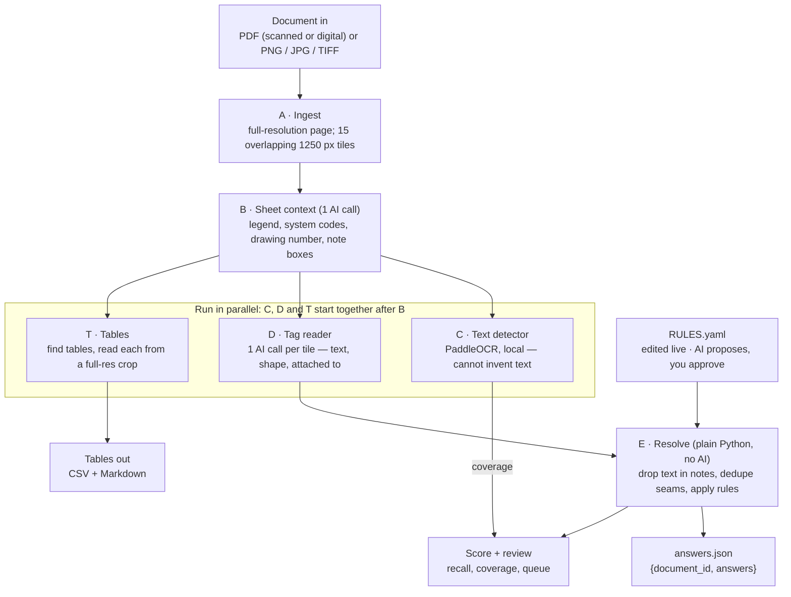
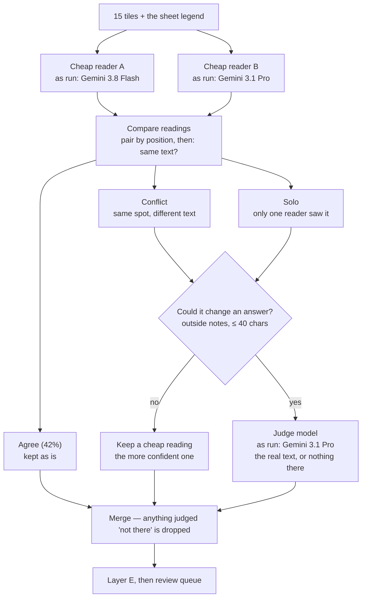

# Xmentium — Write-up

## What we're building

A pipeline that reads a scanned engineering drawing and returns its contents as structured data —
**Doc 1: 100% recall, Doc 2: 75%, and every cell of Doc 3's tables right** — with each value traceable
to the pixels and the rule that produced it.

**The problem.** The three Seabrook Station sheets are 5088 × 3296 px scans with no text layer. Tags
are ~18 px tall, in a thin CAD font where V/Y and 0/O look alike, drawn over pipe lines. Classic OCR
(Tesseract) found zero tags. Sending a whole page to a vision model fails too: the API shrinks it to
2576 px and `V113` becomes `V1I3`.

| Sheet | What it is | Output | Judged by |
| --- | --- | --- | --- |
| Docs 1, 2 | P&IDs (piping and instrument diagrams) | `{document_id, answers: {category: [values]}}` | Answer keys (sparse spot-checks) |
| Doc 3 | Service-water sheet with tables | Every table, cell for cell (CSV + Markdown) | 100% cell accuracy |
| Doc 4 | Unseen, given live | Either of the above | Live review with the SMEs |

**What matters most is the unseen Doc 4**, not the score on Docs 1–2. So the design separates a
*general reader* that describes what is drawn from a *small, editable rules file* that turns those
descriptions into the categories asked for. Nothing is fine-tuned: knowledge about the drawings
lives in rules anyone can read, test and change in the 10-minute live window.

## End-to-end pipeline

AI models only *describe* what is drawn; plain Python plus an editable rules file decides which
category each thing belongs to.

| Layer | Job | Tool | Why this tool |
| --- | --- | --- | --- |
| A · Ingest | PDF or image → full-resolution page; cut into tiles | PyMuPDF, Pillow | Tiles stay under the API's 2576 px limit, so tag text is never shrunk |
| B · Sheet context | Read the legend, system codes, drawing number; box the notes and title block | 1 vision call (Opus 5) | Each sheet defines its own symbols, so reading them at run time is how Doc 4 adapts |
| C · Detector | Find every region with text | PaddleOCR (local CPU) | Can't invent text, so it's an honest check on what the AI skipped |
| D · Tag reader | Per tile: text, symbol shape, what it's attached to, box | 1 vision call per tile (Opus 5) | Reports what it sees, never categories, so a new category never needs a new read |
| T · Tables | Find tables, read each one cell by cell | 1 call to find + 1 per table (Sonnet 5) | One table per call at full resolution is the biggest accuracy lever |
| E · Resolve | Map readings to answer categories | Python + `RULES.yaml` | Same input, same output; instant and free to re-run; every answer explainable |

Around it: a scorer (recall against the key, precision as a lower bound, coverage, exact vs.
after-cleanup matches); a viewer showing the full-resolution crop and rule behind any value, live
cost per AI call, a review queue and a rule assistant; and `scripts/extract.py doc.pdf`, which
writes `answers.json` and the tables in one command.

## Cascade run (an alternative Layer D)

Two cheap readers check each other; only their disagreements go to a stronger judge. We escalate on
*disagreement*, not the model's own confidence — junk readings scored 0.88 too.

**Result: on these sheets the cascade costs more and adds nothing.**

| Setup | Doc 1 recall | Doc 2 recall | Cost, both docs | Time, both docs |
| --- | --- | --- | --- | --- |
| Cascade: Gemini Flash + Gemini 3.1 Pro → Gemini 3.1 Pro | 93.9% | 50% | $3.53 | 12 min |
| Gemini 3.8 Flash alone | 93.9% | 50% | $0.40 | 2 min |
| Claude Opus 5 alone | 100% | 75% | $8.58 | 15 min |

The readers agreed on only 42% of readings, so 245 of 290 disputes on Doc 1 went to the judge —
mostly one reader reporting text the other missed. It paid for all three models and landed where
the cheaper reader alone already was.

## How rules raise recall

**Rule changes took Doc 1 from 84.8% to 97.0% without a single new AI call**; a prompt fix took it
to 100%. Each fix came from looking at a miss in the inspector, seeing what the model *actually
wrote*, and adjusting the rule — never the value.

| Step | What changed | Doc 1 (33) | Doc 2 (4) | New AI calls? |
| --- | --- | --- | --- | --- |
| Starting rules | Hand-written from the legend and the key's category names | 84.8% | 50% | — |
| Pump tag | Find `P-392` inside "VAC PUMP P-392" | | | No |
| Panels and sinks | Join a name and its tag read separately: "PRIMARY SAMPLE PANEL" + `CP-166A` | | | No |
| Boundary codes | Split "DM SS" on spaces; keep only codes the sheet's legend defines | | | No |
| Spacing | Stop squeezing spaces out of multi-word values | **97.0%** | 50% | No |
| Prompt: one bubble, one tag | Read `PCV` over `2829` as one tag; stop nudging the model toward "U-bend" | **100%** | 50% | Yes |
| Connector letter | Keep the letter in the arrow head: `Z 20350` → `Z20350` | 100% | **75%** | No |

The same rule fixes lifted every reader on the same saved readings (cascade 78.8% → 90.9%, GPT-5.5
75.8% → 81.8%). Every rule change is re-scored on *both* keyed sheets before it is kept — the
viewer's rule assistant does this automatically when it proposes changes for a new sheet.

## Benchmark

Same rules, same legend read and same prompt for every setup; re-scored from saved readings
(`scripts/benchmark_models.py`, full tables in `data/bench/benchmark.md`).

### Layer D — reading tags (Docs 1–2)

| Reader | Doc 1 recall (33) | Doc 2 recall (4) | Exact matches (of 37) | Coverage, Doc 1 | Cost, both docs | Time, both docs |
| --- | --- | --- | --- | --- | --- | --- |
| **Claude Opus 5** | **100%** | **75%** | 29 | 76.5% | $8.58 | 15 min |
| GPT-5.5 | 87.9% | 75% | 27 | 54.1% | $10.49 | 19 min |
| Gemini 3.8 Flash | 93.9% | 50% | 26 | 41.8% | **$0.40** | **2 min** |
| Gemini 3.1 Pro | 93.9% | 25% | 25 | 64.9% | $2.31 | 9 min |
| Claude Sonnet 5 | 81.8% | 25% | 23 | 50.5% | $4.70 | 23 min |
| Claude Haiku 4.5 | 51.5% | 25% | 14 | 5.9% | $0.63 | 3 min |
| Cascade, Gemini only | 93.9% | 50% | 26 | 56.4% | $3.53 | 12 min |

*Exact matches* need no punctuation cleanup (the key writes `PID-1-SS_LR20519`; the drawing prints
`PID-1-SS-LR20519`). *Coverage* is the share of text the independent detector found that the reader
also reported; it also reflects box accuracy. Doc 2's key has 4 values, so one value is 25 points.

### Layer B — reading the legend (all 3 sheets)

| Model | Drawing numbers right | Doc 1 recall with it | Doc 2 recall with it | Cost, 3 sheets |
| --- | --- | --- | --- | --- |
| **Claude Opus 5** | 3/3 | 100% | 75% | $0.18 |
| Claude Sonnet 5 | 3/3 | 100% | 75% | $0.08 |
| Gemini 3.1 Pro | 3/3 | 100% | 75% | $0.04 |
| GPT-5.5 | 3/3 | 100% | 75% | $0.63 |
| Claude Haiku 4.5 | 2/3 (`LR20791` for `LR20794`) | 90.9% | 75% | $0.02 |

### Layer T — tables (Doc 3: 3 tables, 62 data cells, each model read twice)

| Model | Data cells exact (read 1 / read 2) | Same answer both reads | Cost per read | Time per read |
| --- | --- | --- | --- | --- |
| **Claude Sonnet 5** | **62 / 62** | 100% | $0.029 | 32 s |
| **Gemini 3.8 Flash** | **62 / 62** | 100% | $0.006 | 20 s |
| Gemini 3.1 Pro | 62 / 62 | 98.8% | $0.018 | 47 s |
| Claude Opus 5 | 48 / 48 | 88% | $0.069 | 27 s |
| GPT-5.5 | 44 / 44 | 98.8% | $0.152 | 54 s |
| Claude Haiku 4.5 | 41 / 41 | 98.7% | $0.006 | 8 s |

Opus read the 14 drain-valve tags `V523…` as `Y523…` on both reads: the CAD font's V/Y confusion
repeats within one model, which is why the best tag reader is not the best table reader.

## Recommended setup

**Demo: the accurate setup** — about $3–6 and 6–10 minutes per sheet. For volume, the budget setup
does ~94% of the job for under $0.30 a sheet.

| Layer | Accurate (demo default) | Budget | Why |
| --- | --- | --- | --- |
| B · legend | Claude Opus 5 ($0.06) | Claude Sonnet 5 ($0.03) | One call per sheet; every later layer inherits its mistakes. Haiku got a drawing number wrong |
| C · detector | PaddleOCR server detector (free, ~3 min fresh) | same | Can't invent text; the mobile detector missed answer-key hexagons |
| D · tag reader | Claude Opus 5 ($3–5.50, 5–10 min) | Gemini 3.8 Flash ($0.16–0.25, ~1 min) | Only Opus reaches 100% on Doc 1; Flash reaches 94% at 1/20th the cost |
| T · tables | Claude Sonnet 5 ($0.03) | Gemini 3.8 Flash ($0.006) | Both 62/62 on two reads; Opus misreads V as Y |
| Cascade | Off | Off | Costs the sum of its readers; scored no better |

## Tried and rejected, known failure modes, next steps

| Idea | What happened | Decision |
| --- | --- | --- |
| Tesseract OCR | Zero tags; `2864` read as `2564` even at 3× zoom | Rejected |
| Whole-page vision calls | Page shrunk to 2576 px; `V113` → `V1I3` | Rejected — tile at full resolution |
| Escalate on the model's own confidence | Right and junk readings both ~0.88; only 2 of 707 below the floor | Rejected — escalate on disagreement |
| Two cheap readers + a judge | 42% agreement; same recall as Flash alone at 9× the cost | Off |
| PaddleOCR mobile detector | 11× faster, missed answer-key hexagons | Rejected |
| Self-hosted open vision model | 1–2 days of setup; a GPU as a single point of failure in the demo | Deferred — one interface keeps the swap to one file |

**Known failure modes.** V/Y, 0/O, 1/I in the CAD font — and the mistakes repeat within one model.
Categories defined by a symbol depend on how the model describes it (`PCV2829` read correctly, stem
described as reaching a regulator, so the U-bend rule misses it). Note/title boxes drawn in the
wrong place can drop real values (the review queue lists them). Rules written for one sheet may
catch junk on another (the hexagon rule on Doc 3). Providers differ in conventions (Gemini's
0–1000 boxes silently broke its results until fixed).

**With more time.** Read digital PDFs' text layer directly before any vision call; re-read regions
the detector found but no model read; add example symbol images to the reader's prompt; train a
small symbol detector, then a distilled open model, on reviewed labels.

## Questions for you (the SMEs)

1. **Is the U-bend loop what defines `pressure_control_valves (U-bend_pipe)`**, or how those valves happen to be drawn? Our only Doc 2 miss is here.
2. **Is `instrument_bubbles` the set of prefix types** on the sheet (PI, TI, PCV) rather than instances?
3. **Doc 2's demineralized-water connectors read `A`, `X`, `Y`, `Z 20350`; the key lists only `Z20350`.** Is the letter part of the connection's identity, and why only Z?
4. **Do title-block and revision tables count as "every table on the sheet"?** We skip them today.
5. **For Doc 4: which categories do you want?** We'll add or adjust rules for any we don't cover.
